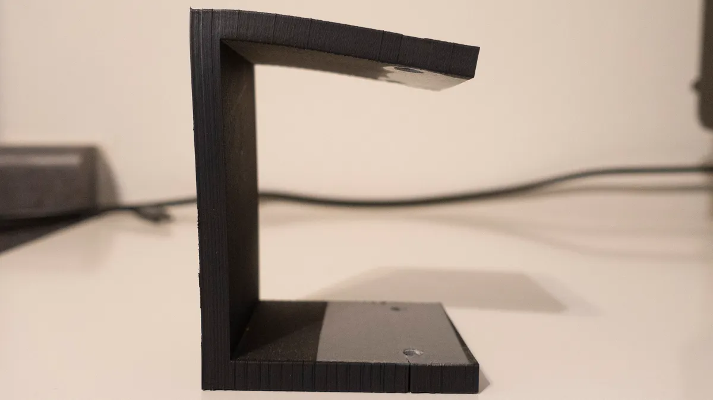

# Halloween Mobile
A Halloween Mobile to Show Some Art

My daughter wanted someplace to display some artwork at Halloween time. It would be nice if everyone coming to the door would see it and for there to be a bit of motion to attract some attention. The initial thought was to have an Arduino (we used an Uno clone at this point) run a motion detector and a motor to drive a couple pulleys. That way it would turn on when someone walked up and several bits of craft could be hung on the string around the pulleys. We rigged up a little test with a stepper motor we already had from an Arduino kit, some clothesline pulleys from Home Depot and a 3D printed holder and pulley to fit the motor. The Arduino sketch and the OpenSCAD parts are in the repo. Below is what it looked like:

Since the general idea seemed to work we decided to add some fog and music. We already had the fog machine from our previous [fog cannon project](https://github.com/dcknuth/fog_cannon) and it had a remote control. Maybe we could clone the code from the remote and tie it in to a transmitter controlled by the Arduino. Then we needed to order an SD card reader to provide a place to put our music track. This then all needed a place to live, so 3D prints of enclosures for the Arduino Mega clone (ran out of pins on the Uno) and the motion detector. We also printed a shield for the stepper motor controller to block the lights of the LEDs. Then to clean up the wiring and hide things, a little blackout cloth was tied into place.

Now when a trick-or-treater came to the door, the motion detector should sense it, start the motor, music and fog. Mother and daughter made a paper mache hell hound head (modeled after an old Scooby-Do episode) to push the fog through. We made a larger assembly and spray painted the whole thing black. The end result is below.

Now, some credit where due. [The Drone Bot Workshop](https://dronebotworkshop.com/) is awesome. Most internet information on stepper motors sucks, but not [this](https://www.youtube.com/watch?v=0qwrnUeSpYQ). Then I found a bunch of incomplete information about working with an RF remote and then [this](https://www.youtube.com/watch?v=b5C9SPVlU4U). Now I just search the Drone Bot Workshop channel first for whatever I need. High quality videos with great, careful explanations of each topic and easy to follow wiring instructions. Code is always on the web site and works.

## Lessons Learned
There were a couple issue to overcome, first PLA painted black with spray-paint and left in the sun, will warp. This was a nice 90 degree angle when printed.

Another interesting thing is that if you are both driving and detecting motion, you can get into a physically driven infinite loop. Also, download your smart doorbell video before a day or two or it will not be there when you finally get around to writing the blog post (two months later.) Finally, a couple pictures during the process:
